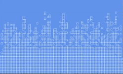

# Particle-Sim2
A remake of my [java-libGDX particle simulator](https://github.com/Charleco/Particle-Sim) in C# using the [MonoGame]() framework. 

Utilizes the [Primitive Buddy](https://www.nuget.org/packages/PrimitiveBuddy/) library for shape rendering.